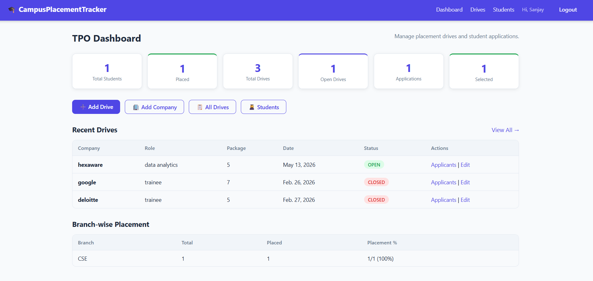
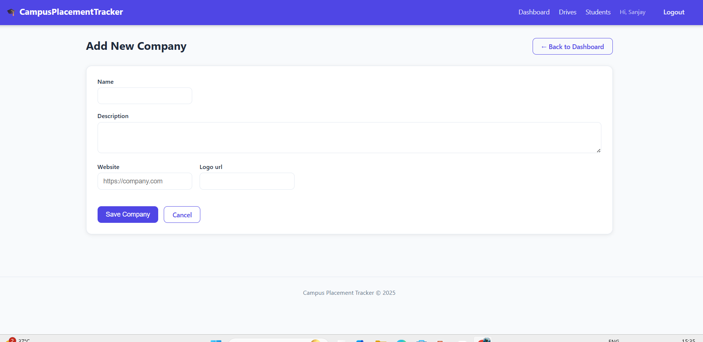
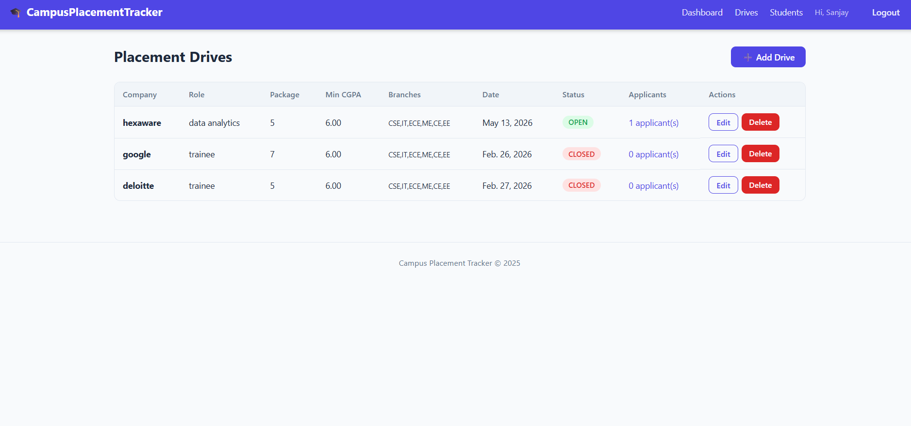
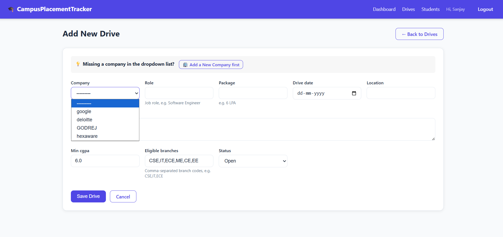
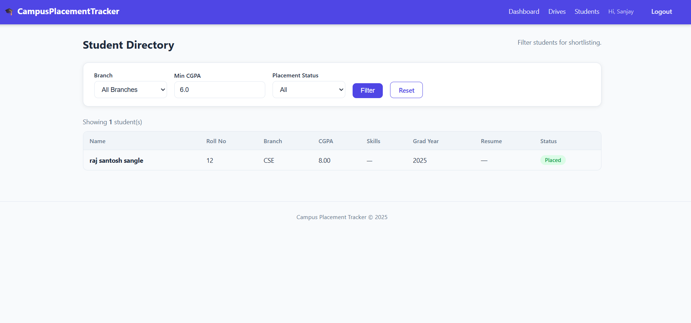
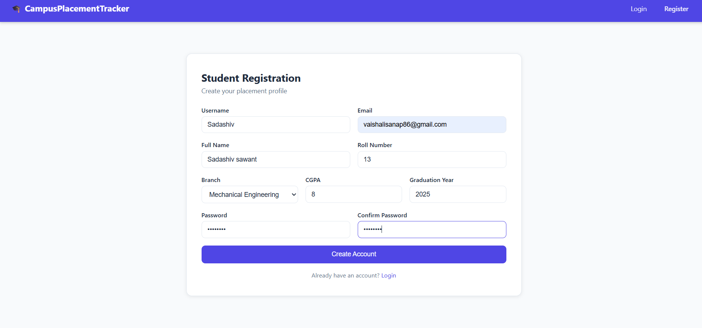
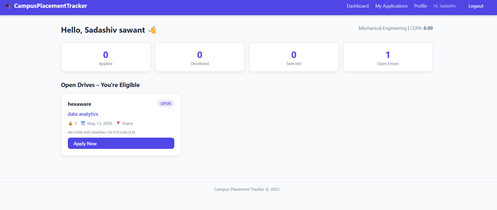
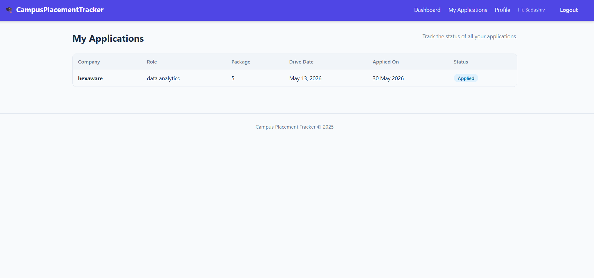
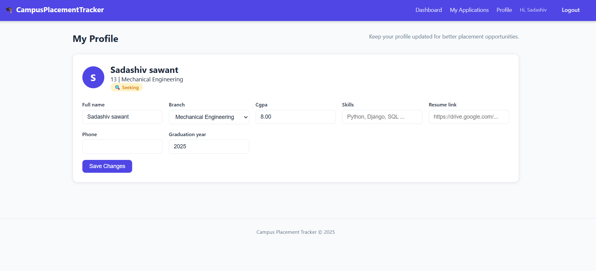

# 🎓 CampusPlacementTracker

A Django full-stack web app with two roles: **Student** and **TPO (Training & Placement Officer)**.

---

## 📸 Application Previews

Below are actual screenshots showcasing the sleek user interface and full-stack functionality of the **Campus Placement Tracker**. Click on any section to expand the preview!

### 💼 TPO (Training & Placement Officer) Dashboard & Tools
The TPO panel features data analytics, company and drive management, and student filtering.

<details>
<summary><b>📊 TPO Dashboard (Click to expand)</b></summary>
<br>

*Displays branch-wise placement percentages, total drives, registered students, and recent placement activities.*

</details>

<details>
<summary><b>🏢 Company Management (Click to expand)</b></summary>
<br>

*Add and manage companies with detailed descriptions and industry categorization.*

</details>

<details>
<summary><b>📅 Placement Drives List & Management (Click to expand)</b></summary>
<br>

*Create, view, and update placement drives. TPOs can easily see active recruitment schedules.*

</details>

<details>
<summary><b>✍️ Create Placement Drive Form (Click to expand)</b></summary>
<br>

*Schedule a drive by setting the company, job role, package (LPA), minimum CGPA criteria, and allowed academic branches.*

</details>

<details>
<summary><b>👥 Student Directory & Filter (Click to expand)</b></summary>
<br>

*Search and filter students by branch, minimum CGPA, and placement status (e.g. Selected, Pending).*

</details>

---

### 🎓 Student Dashboard & Journey
Students have their own customized dashboards to search and apply to eligible drives and track application status.

<details>
<summary><b>📝 Student Registration (Click to expand)</b></summary>
<br>

*Self-service portal for students to register with academic parameters (CGPA, Roll Number, Branch).*

</details>

<details>
<summary><b>📈 Student Dashboard & Eligible Jobs (Click to expand)</b></summary>
<br>

*Students see placement drives they are eligible for. Non-eligible drives (due to CGPA or branch) are filtered out automatically.*

</details>

<details>
<summary><b>📋 Application Tracker (Click to expand)</b></summary>
<br>

*Real-time visual timeline showing the status of each application (Applied → Shortlisted → Selected/Rejected).*

</details>

<details>
<summary><b>👤 Student Profile & Resume Edit (Click to expand)</b></summary>
<br>

*Students can update their skills, profile details, and host their resume links.*

</details>

---

## 📁 Project Structure

```
CampusPlacementTracker/
│
├── manage.py
├── requirements.txt
├── README.md
├── db.sqlite3
│
├── CampusPlacementTracker/          ← Django project config
│   ├── __init__.py
│   ├── settings.py
│   ├── urls.py
│   └── wsgi.py
│
├── accounts/                        ← Custom User, StudentProfile, Auth
│   ├── migrations/
│   ├── __init__.py
│   ├── admin.py
│   ├── forms.py
│   ├── models.py
│   ├── urls.py
│   └── views.py
│
├── placements/                      ← Company, Drive, Application
│   ├── migrations/
│   ├── __init__.py
│   ├── admin.py
│   ├── forms.py
│   ├── models.py
│   ├── urls.py
│   └── views.py
│
├── templates/
│   ├── base.html
│   ├── accounts/
│   │   ├── login.html
   │   │   ├── register.html
   │   │   └── profile.html
   │   └── placements/
   │       ├── student_dashboard.html
   │       ├── my_applications.html
   │       ├── tpo_dashboard.html
   │       ├── drive_list.html
   │       ├── drive_form.html
   │       ├── drive_applicants.html
   │       ├── update_application.html
   │       ├── student_list.html
   │       └── confirm_delete.html
   │
   ├── static/
   │   ├── css/style.css
   │   └── js/main.js
   │
   └── photos/                          ← Screenshot Previews
       ├── 01_tpo_dashboard.png
       ├── 02_tpo_add_company.png
       ├── 03_tpo_drive_list.png
       ├── 04_tpo_create_drive.png
       ├── 05_tpo_student_list.png
       ├── 06_student_register.png
       ├── 07_student_dashboard.png
       ├── 08_student_applications.png
       └── 09_student_profile.png
```

---

## ⚙️ Setup Instructions

### Step 1 – Create & Activate Virtual Environment

```bash
# Create
python -m venv venv

# Activate (Windows)
venv\Scripts\activate

# Activate (Mac/Linux)
source venv/bin/activate
```

### Step 2 – Install Dependencies

```bash
pip install -r requirements.txt
```

### Step 3 – Run Migrations

```bash
python manage.py makemigrations accounts
python manage.py makemigrations placements
python manage.py migrate
```

### Step 4 – Create Superuser (for Django Admin)

```bash
python manage.py createsuperuser
```
> Enter username, email, password when prompted.

### Step 5 – Start the Server

```bash
python manage.py runserver
```

Open your browser at: **http://127.0.0.1:8000**

---

## 👤 Creating a TPO Account

TPO accounts are NOT created via public registration (by design — security).
Create them through Django Admin:

1. Go to **http://127.0.0.1:8000/admin/**
2. Login with your superuser credentials
3. Go to **Users → Add User**
4. Fill in username, password
5. Set **Role = TPO**
6. Save

Now login at `/accounts/login/` with those credentials — you'll land on the **TPO Dashboard**.

---

## 🌐 Live Hosting & Production Notes

This application is production-ready and works **perfectly when hosted live** in cloud environments (such as **Render**, **Heroku**, **PythonAnywhere**, or **AWS**).

### 💡 Production Best Practices:
1. **Database Engine**: While development uses SQLite (`db.sqlite3`), you can easily switch to a robust production database like **PostgreSQL** or **MySQL** in `CampusPlacementTracker/settings.py` by using environment variables and `dj-database-url`.
2. **Static Assets**: Run `python manage.py collectstatic` to gather all styling and script assets, and serve them securely via **WhiteNoise** or an AWS S3 Bucket.
3. **Environment Security**: Keep sensitive settings (like `SECRET_KEY`, `DEBUG = False`, and database credentials) safe using `.env` or system environment variables in production rather than hardcoding them.

---

## 🎯 Features

### Student
- Register with academic details (CGPA, branch, roll number)
- View drives they are eligible for (auto-filtered)
- Apply to drives in one click
- Track application status (Applied → Shortlisted → Selected / Rejected)
- Update profile (skills, resume link, contact)

### TPO
- Dashboard with placement stats (branch-wise)
- Add / Edit / Delete company drives
- Set eligibility (min CGPA, allowed branches)
- View all applicants per drive
- Update application status (shortlist, select, reject)
- Filter students by branch, CGPA, placement status

---

## 🔗 Key URLs

| URL | Description |
|-----|-------------|
| `/accounts/login/` | Login page |
| `/accounts/register/` | Student registration |
| `/accounts/profile/` | Student profile edit |
| `/placements/dashboard/` | Student dashboard |
| `/placements/my-applications/` | Student application tracker |
| `/placements/tpo/` | TPO dashboard |
| `/placements/tpo/drives/` | Drive management |
| `/placements/tpo/students/` | Student directory |
| `/admin/` | Django admin panel |

---

## 🛠️ Tech Stack

| Layer | Technology |
|-------|-----------|
| Backend | Python, Django 4.x |
| Database | SQLite (default) |
| Frontend | HTML5, CSS3, JavaScript |
| Auth | Django built-in auth + Custom User Model |
| ORM | Django ORM |
| Views | Class-Based Views (CBV) + Function Views |
